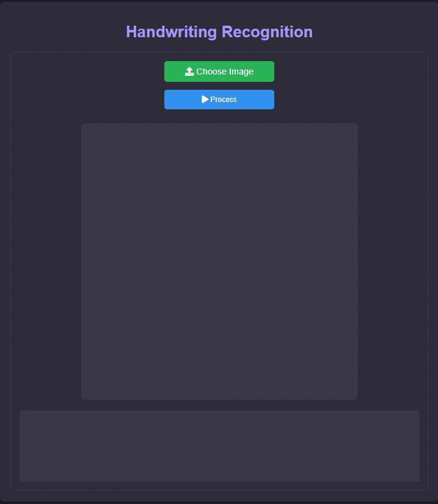
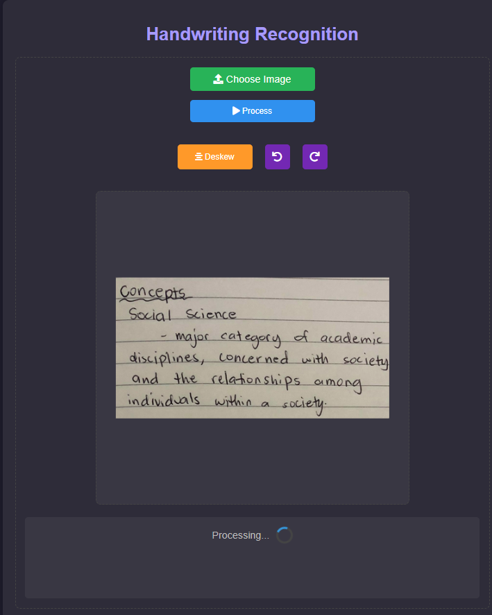
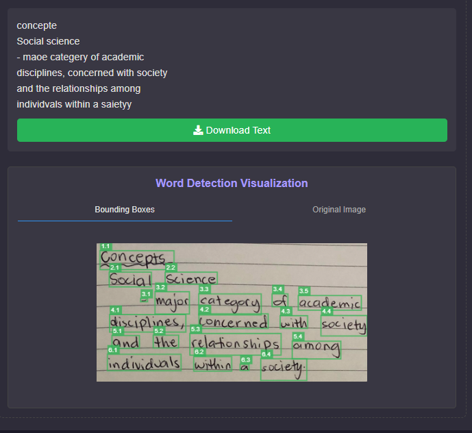

# Handwriting2Text

[Click here to view the live site](https://huggingface.co/spaces/Nimehs/Handwriting2Text)

A simple system that converts handwritten text into digital format using deep learning techniques. The project uses object detection and OCR models to identify and recognize handwritten words from an image, with an easy-to-use web interface.

## Features

-  **Word Detection**: Utilizes YOLO (You Only Look Once) for detecting individual handwritten words in an image.
-  **Text Recognition**: Applies CRNN (Convolutional Recurrent Neural Network) for Optical Character Recognition (OCR) to convert image segments into readable text.
-  **Web Interface**: A simple and intuitive web interface for uploading images and viewing the extracted text.

## 🛠️ Technologies Used

- YOLO (for word detection)
- CRNN (for OCR)
- Flask (for the web interface)

### Screenshot 1

### Game Screenshot 2

### Game Screenshot 3

